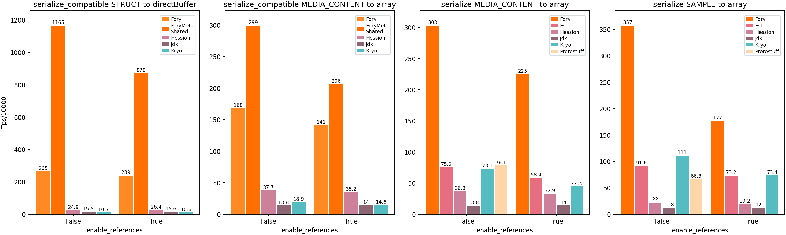
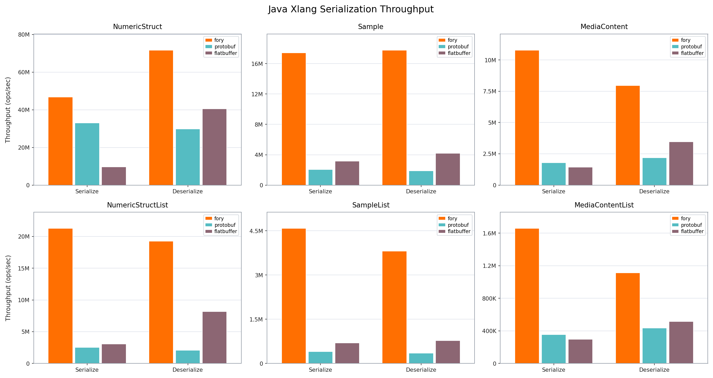

<div align="center">
  <br>
</div>

[](https://github.com/apache/fory/actions/workflows/ci.yml)
[](https://join.slack.com/t/fory-project/shared_invite/zt-36g0qouzm-kcQSvV_dtfbtBKHRwT5gsw)
[](https://x.com/ApacheFory)
[](https://search.maven.org/#search|gav|1|g:"org.apache.fory"%20AND%20a:"fory-core")
[](https://crates.io/crates/fory)
[](https://pypi.org/project/pyfory/)
[](https://www.npmjs.com/package/@apache-fory/core)
[](https://www.nuget.org/packages/Apache.Fory)
[](https://pub.dev/packages/fory)

**Apache Fory™** is a blazingly fast multi-language serialization framework for
idiomatic domain objects, schema IDL, and cross-language data exchange.

<https://fory.apache.org>

> [!IMPORTANT]
> Apache Fory™ was previously named Apache Fury. For versions before 0.11, use
> `fury` instead of `fory` in package names, imports, and dependencies. See the
> [Fury docs](https://fory.apache.org/docs/0.10/docs/introduction/) for older
> releases.

## Why Fory

Fory is built for fast, compact serialization across languages and runtimes. It
works with idiomatic objects in each language, supports shared schemas when you
need a contract, and preserves object features such as shared and circular
references.

- **Efficient Cross-Language Encoding**: Exchange payloads across supported
  languages with compact binary encoding, metadata packing, schema evolution,
  shared/circular references, and polymorphic runtime types.
- **Domain Objects First**: Serialize Java classes, Python dataclasses, Go
  structs, Rust/C++ structs, and generated or annotated model types directly.
  Preserve shared and circular references when object identity matters.
- **Reference-Aware Schema IDL**: Support shared and circular references
  directly in the schema, alongside numbers, strings, lists, maps, arrays,
  enums, structs, and unions. Define schemas once, then generate native domain
  objects for each language without forcing wrapper types into user code.
- **Row-Format Random Access**: Read fields, arrays, and nested values without
  rebuilding full objects, with zero-copy access, partial reads, and Arrow
  integration.
- **Optimized Runtimes**: Java JIT serializers and generated/static serializers
  in other runtimes keep hot paths fast and payloads compact.
- **Language And Platform Support**: Java, Python, C++, Go, Rust,
  JavaScript/TypeScript, C#, Swift, Dart, Scala, and Kotlin, including GraalVM
  native image, Dart VM/Flutter/web, and Node.js/browser JavaScript.

## Performance

Benchmarks show Fory delivering higher throughput and smaller serialized
payloads than common serialization frameworks on representative workloads. Java
has the broadest comparison set; the other charts show runtime-specific results
across supported languages.

**Java** [Benchmarks](docs/benchmarks/java)

In Java serialization benchmarks, Fory reaches up to **170x** the throughput of
JDK serialization on selected workloads.

<p align="center">

</p>

<p align="center">

</p>

<p align="center">

</p>

**Python** [Benchmarks](benchmarks/python)

<p align="center">

</p>

**Rust** [Benchmarks](benchmarks/rust)

<p align="center">

</p>

<details>
<summary><strong>Benchmarks for <a href="benchmarks/cpp">C++</a>, <a href="benchmarks/go">Go</a>, <a href="docs/benchmarks/javascript">JavaScript/TypeScript</a>, <a href="docs/benchmarks/csharp">C#</a>, <a href="docs/benchmarks/swift">Swift</a>, and <a href="docs/benchmarks/dart">Dart</a></strong></summary>

**C++** [Benchmarks](benchmarks/cpp)

<p align="center">

</p>

**Go** [Benchmarks](benchmarks/go)

<p align="center">

</p>

**JavaScript/TypeScript** [Benchmarks](docs/benchmarks/javascript)

<p align="center">

</p>

**C#** [Benchmarks](docs/benchmarks/csharp)

<p align="center">

</p>

**Swift** [Benchmarks](docs/benchmarks/swift)

<p align="center">

</p>

**Dart** [Benchmarks](docs/benchmarks/dart)

<p align="center">

</p>

</details>

## Installation

Pick the runtime you use and run the package-manager command, or paste the
dependency block into your build file.

**Java**

Maven:

```xml
<dependency>
  <groupId>org.apache.fory</groupId>
  <artifactId>fory-core</artifactId>
  <version>0.17.0</version>
</dependency>
```

Gradle:

```gradle
implementation "org.apache.fory:fory-core:0.17.0"
```

**Scala**

sbt:

```scala
libraryDependencies += "org.apache.fory" %% "fory-scala" % "0.17.0"
```

**Kotlin**

Gradle:

```kotlin
implementation("org.apache.fory:fory-kotlin:0.17.0")
```

Maven:

```xml
<dependency>
  <groupId>org.apache.fory</groupId>
  <artifactId>fory-kotlin</artifactId>
  <version>0.17.0</version>
</dependency>
```

**Python**

```bash
pip install pyfory
```

For row-format support:

```bash
pip install "pyfory[format]"
```

**Rust**

`Cargo.toml`:

```toml
[dependencies]
fory = "0.17"
```

**C++**

CMake:

```cmake
include(FetchContent)
FetchContent_Declare(
  fory
  GIT_REPOSITORY https://github.com/apache/fory.git
  GIT_TAG v0.17.0
  SOURCE_SUBDIR cpp
)
FetchContent_MakeAvailable(fory)
target_link_libraries(my_app PRIVATE fory::serialization)
```

Bazel:

```bazel
# MODULE.bazel
bazel_dep(name = "fory", version = "0.17.0")
git_override(module_name = "fory", remote = "https://github.com/apache/fory.git", commit = "v0.17.0")

# BUILD
deps = ["@fory//cpp/fory/serialization:fory_serialization"]
```

See the [C++ installation guide](https://fory.apache.org/docs/guide/cpp/#installation)
for complete CMake, Bazel, and source-build details.

**Go**

```bash
go get github.com/apache/fory/go/fory
```

**JavaScript/TypeScript**

```bash
npm install @apache-fory/core
```

For the Node.js string fast path:

```bash
npm install @apache-fory/core @apache-fory/hps
```

**C#**

```bash
dotnet add package Apache.Fory --version 0.17.0
```

**Dart**

```bash
dart pub add fory:^0.17.0
dart pub add dev:build_runner
```

**Swift**

Add Fory to `Package.swift`:

```swift
dependencies: [
  .package(url: "https://github.com/apache/fory.git", exact: "0.17.0")
],
targets: [
  .target(
    name: "YourTarget",
    dependencies: [.product(name: "Fory", package: "fory")]
  )
]
```

See the [Swift guide](https://fory.apache.org/docs/guide/swift/) for generated
serializer setup.

**Development From Source**

See [docs/DEVELOPMENT.md](docs/DEVELOPMENT.md).

Snapshots for Java, Scala, and Kotlin are available from
`https://repository.apache.org/snapshots/` with the matching `-SNAPSHOT` version.

## Choose Serialization Mode

| Mode                 | Use it when                                                   | Start here                                               |
| -------------------- | ------------------------------------------------------------- | -------------------------------------------------------- |
| Xlang serialization  | Data crosses language boundaries                              | [Cross-language guide](docs/guide/xlang)                 |
| Native serialization | Producer and consumer are in the same language                | Language guide for your runtime                          |
| Row format           | You need random field access or analytics-style partial reads | [Row format spec](docs/specification/row_format_spec.md) |

Use native mode for same-language traffic. It avoids xlang's cross-language
type mapping and metadata constraints, so it can serialize broader
language-specific object graphs and is the fastest path for same-language
payloads.

Compatible mode is Fory's schema-evolution mode. It writes the metadata readers
and writers need to tolerate schema differences. Xlang mode enables compatible
mode by default to better handle differences between language type systems.
Native mode keeps it off by default for smaller payloads and higher throughput.

Use compatible mode when services deploy independently or when fields may be
added or deleted over time. Use schema-consistent mode when writer and reader
schemas deploy together and you want the smallest payloads.

For xlang, all peers must agree on type identity. Name-based registration is
easier to read in examples. Numeric IDs are smaller and faster, but they require
coordination across every reader and writer.

## Cross-Language Serialization

Xlang mode writes the cross-language Fory wire format. Bytes produced by one
runtime can be read by another when the runtimes use the same type identity,
compatible mode setting, and field schema.

**Java**

```java
import org.apache.fory.Fory;

public class Example {
  public static class Person {
    public String name;
    public int age;
  }

  public static void main(String[] args) {
    Fory fory = Fory.builder().withXlang(true).withCompatible(true).build();
    fory.register(Person.class, "example.Person");

    Person person = new Person();
    person.name = "Alice";
    person.age = 30;

    byte[] bytes = fory.serialize(person);
    Person decoded = (Person) fory.deserialize(bytes);
    System.out.println(decoded.name);
  }
}
```

**Python**

```python
from dataclasses import dataclass

import pyfory

@dataclass
class Person:
    name: str
    age: pyfory.Int32

fory = pyfory.Fory(xlang=True, compatible=True)
fory.register_type(Person, typename="example.Person")

data = fory.serialize(Person("Alice", 30))
person = fory.deserialize(data)
print(person.name)
```

**Go**

```go
package main

import (
    "fmt"

    "github.com/apache/fory/go/fory"
)

type Person struct {
    Name string
    Age  int32
}

func main() {
    f := fory.New(fory.WithXlang(true), fory.WithCompatible(true))
    if err := f.RegisterStructByName(Person{}, "example.Person"); err != nil {
        panic(err)
    }

    data, _ := f.Serialize(&Person{Name: "Alice", Age: 30})
    var person Person
    if err := f.Deserialize(data, &person); err != nil {
        panic(err)
    }
    fmt.Println(person.Name)
}
```

**Rust**

```rust
use fory::{Error, Fory, ForyStruct};

#[derive(ForyStruct, Debug, PartialEq)]
struct Person {
    name: String,
    age: i32,
}

fn main() -> Result<(), Error> {
    let mut fory = Fory::builder().xlang(true).compatible(true).build();
    fory.register_by_name::<Person>("example", "Person")?;

    let bytes = fory.serialize(&Person {
        name: "Alice".to_string(),
        age: 30,
    })?;
    let person: Person = fory.deserialize(&bytes)?;
    println!("{}", person.name);
    Ok(())
}
```

**C++**

```cpp
#include "fory/serialization/fory.h"
#include <cstdint>
#include <iostream>
#include <string>

using namespace fory::serialization;

struct Person {
  std::string name;
  int32_t age;
};
FORY_STRUCT(Person, name, age);

int main() {
  auto fory = Fory::builder().xlang(true).compatible(true).build();
  fory.register_struct<Person>("example.Person");

  auto bytes = fory.serialize(Person{"Alice", 30}).value();
  Person person = fory.deserialize<Person>(bytes).value();
  std::cout << person.name << std::endl;
}
```

**JavaScript/TypeScript**

```ts
import Fory, { Type } from "@apache-fory/core";

const personType = Type.struct(
  { typeName: "example.Person" },
  {
    name: Type.string(),
    age: Type.int32(),
  },
);

const fory = new Fory({ compatible: true });
const { serialize, deserialize } = fory.register(personType);

const bytes = serialize({ name: "Alice", age: 30 });
const person = deserialize(bytes);
console.log(person.name);
```

**C#**

```csharp
using Apache.Fory;

[ForyObject]
public sealed class Person
{
    public string Name { get; set; } = string.Empty;
    public int Age { get; set; }
}

Fory fory = Fory.Builder()
    .Compatible(true)
    .Build();
fory.Register<Person>("example", "Person");

byte[] bytes = fory.Serialize(new Person { Name = "Alice", Age = 30 });
Person person = fory.Deserialize<Person>(bytes);
Console.WriteLine(person.Name);
```

C# always writes the xlang frame header, so there is no separate xlang builder
flag.

**Dart**

```dart
import 'package:fory/fory.dart';

part 'person.fory.dart';

@ForyStruct()
class Person {
  Person();

  String name = '';

  @ForyField(type: Int32Type())
  int age = 0;
}

void main() {
  final fory = Fory(compatible: true);
  PersonFory.register(
    fory,
    Person,
    namespace: 'example',
    typeName: 'Person',
  );

  final bytes = fory.serialize(Person()
    ..name = 'Alice'
    ..age = 30);
  final person = fory.deserialize<Person>(bytes);
  print(person.name);
}
```

Dart uses the xlang wire format directly. Generate the companion file before
running:

```bash
dart run build_runner build --delete-conflicting-outputs
```

**Swift**

```swift
import Fory

@ForyStruct
struct Person {
    var name: String = ""
    var age: Int32 = 0
}

let fory = Fory(xlang: true, compatible: true)
try fory.register(Person.self, namespace: "example", name: "Person")

let bytes = try fory.serialize(Person(name: "Alice", age: 30))
let person: Person = try fory.deserialize(bytes)
print(person.name)
```

**Scala**

```scala
import org.apache.fory.Fory
import org.apache.fory.serializer.scala.ScalaSerializers

case class Person(name: String, age: Int)

val fory = Fory.builder()
  .withXlang(true)
  .withCompatible(true)
  .build()
ScalaSerializers.registerSerializers(fory)
fory.register(classOf[Person], "example.Person")

val bytes = fory.serialize(Person("Alice", 30))
val person = fory.deserialize(bytes).asInstanceOf[Person]
println(person.name)
```

**Kotlin**

```kotlin
import org.apache.fory.Fory
import org.apache.fory.serializer.kotlin.KotlinSerializers

data class Person(val name: String, val age: Int)

fun main() {
    val fory = Fory.builder()
        .withXlang(true)
        .withCompatible(true)
        .build()
    KotlinSerializers.registerSerializers(fory)
    fory.register(Person::class.java, "example.Person")

    val bytes = fory.serialize(Person("Alice", 30))
    val person = fory.deserialize(bytes) as Person
    println(person.name)
}
```

For shared/circular references, polymorphism, numeric IDs versus names, and
type-mapping rules, see the [cross-language guide](docs/guide/xlang) and
[type mapping specification](docs/specification/xlang_type_mapping.md).

## Native Serialization

Use native mode when the writer and reader are in the same language. Java and
Python can serialize broader language-specific object graphs this way. The
languages below expose an explicit `xlang=false` or native-mode setting; runtimes
without that switch stay on their documented default path.

Keep class/type registration enabled for untrusted input. See the language guides
for runtime-specific security and compatibility settings.

**Java**

```java
Fory fory = Fory.builder()
    .withXlang(false)
    .requireClassRegistration(true)
    .build();
// Register, serialize, and deserialize as in the xlang example above.
```

**Python**

```python
fory = pyfory.Fory(xlang=False, ref=True)
# Register, serialize, and deserialize as in the xlang example above.
```

**Go**

```go
f := fory.New(fory.WithXlang(false))
// Register, serialize, and deserialize as in the xlang example above.
```

**Rust**

```rust
let mut fory = Fory::builder().xlang(false).build();
// Register, serialize, and deserialize as in the xlang example above.
```

**C++**

```cpp
auto fory = Fory::builder().xlang(false).build();
// Register, serialize, and deserialize as in the xlang example above.
```

**Scala**

```scala
val fory = Fory.builder()
  .withXlang(false)
  .requireClassRegistration(true)
  .build()
ScalaSerializers.registerSerializers(fory)
// Register, serialize, and deserialize as in the xlang example above.
```

**Kotlin**

```kotlin
val fory = Fory.builder()
    .withXlang(false)
    .requireClassRegistration(true)
    .build()
KotlinSerializers.registerSerializers(fory)
// Register, serialize, and deserialize as in the xlang example above.
```

## Row Format

Row format is for random access and partial reads. These examples encode an
object with an integer array field, then read one array element from the binary
row without rebuilding the object.

**Python**

```python
from dataclasses import dataclass
from typing import List

import pyfory

@dataclass
class User:
    id: pyfory.Int32
    name: str
    scores: List[pyfory.Int32]

encoder = pyfory.encoder(User)
binary = encoder.to_row(User(1, "Alice", [98, 100, 95])).to_bytes()

row = pyfory.RowData(encoder.schema, binary)
print(row.name)
print(row.scores[1])
```

**Java**

```java
public class User {
  public int id;
  public String name;
  public int[] scores;
}

RowEncoder<User> encoder = Encoders.bean(User.class);

User user = new User();
user.id = 1;
user.name = "Alice";
user.scores = new int[] {98, 100, 95};

BinaryRow row = encoder.toRow(user);

Schema schema = encoder.schema();
Schema.StringField nameField = schema.stringField("name");
Schema.ArrayField scoresField = schema.arrayField("scores");

String name = nameField.get(row);
ArrayData scores = scoresField.get(row);
int secondScore = scores.getInt32(1);
```

For Java imports, nested structs, arrays/maps, Arrow integration, and partial
deserialization, see the
[Java row-format guide](https://fory.apache.org/docs/guide/java/row_format), the
[Python row-format guide](docs/guide/python/row-format.md), and the
[row-format specification](docs/specification/row_format_spec.md).

## Documentation

**User Guides**

| Guide                 | Source                                                                   | Website                                                         |
| --------------------- | ------------------------------------------------------------------------ | --------------------------------------------------------------- |
| Java                  | [docs/guide/java](docs/guide/java)                                       | [View](https://fory.apache.org/docs/guide/java/)                |
| Python                | [docs/guide/python](docs/guide/python)                                   | [View](https://fory.apache.org/docs/guide/python/)              |
| Rust                  | [docs/guide/rust](docs/guide/rust)                                       | [View](https://fory.apache.org/docs/guide/rust/)                |
| C++                   | [docs/guide/cpp](docs/guide/cpp)                                         | [View](https://fory.apache.org/docs/guide/cpp/)                 |
| Go                    | [docs/guide/go](docs/guide/go)                                           | [View](https://fory.apache.org/docs/guide/go/)                  |
| JavaScript/TypeScript | [docs/guide/javascript](docs/guide/javascript)                           | [View](https://fory.apache.org/docs/guide/javascript/)          |
| C#                    | [docs/guide/csharp](docs/guide/csharp)                                   | [View](https://fory.apache.org/docs/guide/csharp/)              |
| Swift                 | [docs/guide/swift](docs/guide/swift)                                     | [View](https://fory.apache.org/docs/guide/swift/)               |
| Dart                  | [docs/guide/dart](docs/guide/dart)                                       | [View](https://fory.apache.org/docs/guide/dart/)                |
| Scala                 | [docs/guide/scala](docs/guide/scala)                                     | [View](https://fory.apache.org/docs/guide/scala/)               |
| Kotlin                | [docs/guide/kotlin](docs/guide/kotlin)                                   | [View](https://fory.apache.org/docs/guide/kotlin/)              |
| Cross-language xlang  | [docs/guide/xlang](docs/guide/xlang)                                     | [View](https://fory.apache.org/docs/guide/xlang/)               |
| Schema IDL/compiler   | [docs/compiler](docs/compiler)                                           | [View](https://fory.apache.org/docs/compiler/)                  |
| GraalVM native image  | [docs/guide/java/graalvm-support.md](docs/guide/java/graalvm-support.md) | [View](https://fory.apache.org/docs/guide/java/graalvm_support) |
| Development           | [docs/DEVELOPMENT.md](docs/DEVELOPMENT.md)                               | [View](docs/DEVELOPMENT.md)                                     |

**Specifications**

| Specification          | Source                                                                        | Website                                                                          |
| ---------------------- | ----------------------------------------------------------------------------- | -------------------------------------------------------------------------------- |
| Xlang serialization    | [xlang_serialization_spec.md](docs/specification/xlang_serialization_spec.md) | [View](https://fory.apache.org/docs/specification/fory_xlang_serialization_spec) |
| Java serialization     | [java_serialization_spec.md](docs/specification/java_serialization_spec.md)   | [View](https://fory.apache.org/docs/specification/fory_java_serialization_spec)  |
| Row format             | [row_format_spec.md](docs/specification/row_format_spec.md)                   | [View](https://fory.apache.org/docs/specification/fory_row_format_spec)          |
| Cross-language mapping | [xlang_type_mapping.md](docs/specification/xlang_type_mapping.md)             | [View](https://fory.apache.org/docs/specification/fory_xlang_serialization_spec) |

## Community

- [Slack workspace](https://join.slack.com/t/fory-project/shared_invite/zt-36g0qouzm-kcQSvV_dtfbtBKHRwT5gsw)
- [@ApacheFory on X](https://x.com/ApacheFory)
- [GitHub issues](https://github.com/apache/fory/issues)
- Apache Fory mailing lists for development discussion

## Contributing

Read [CONTRIBUTING.md](CONTRIBUTING.md) and
[docs/DEVELOPMENT.md](docs/DEVELOPMENT.md) before sending pull requests. Bug
reports, docs fixes, tests, benchmarks, and runtime improvements are welcome.

## License

Apache Fory™ is licensed under the [Apache License 2.0](LICENSE).
