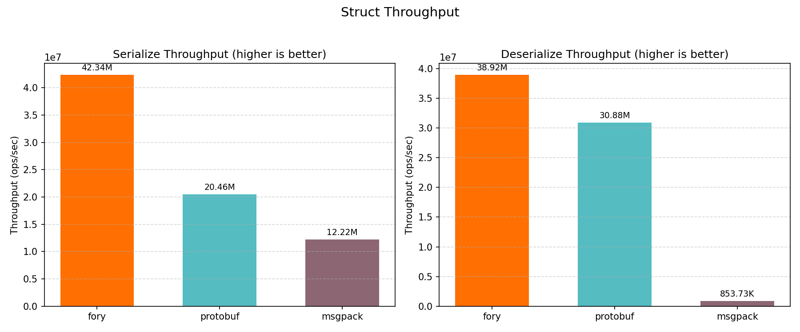
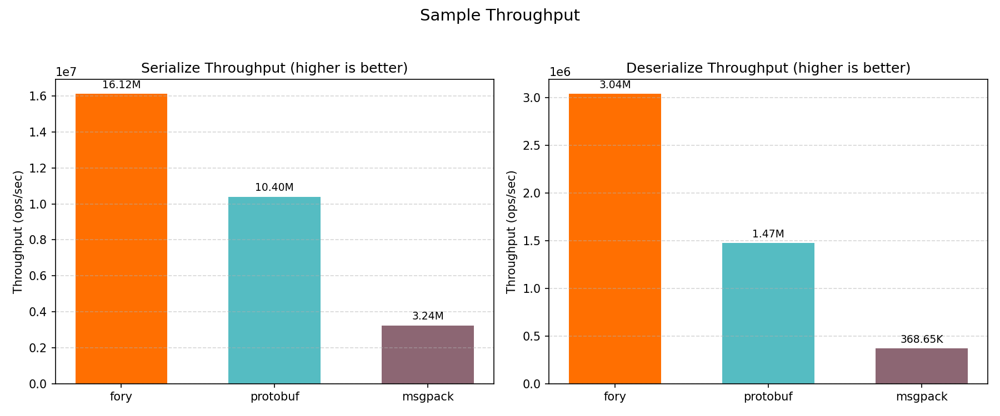
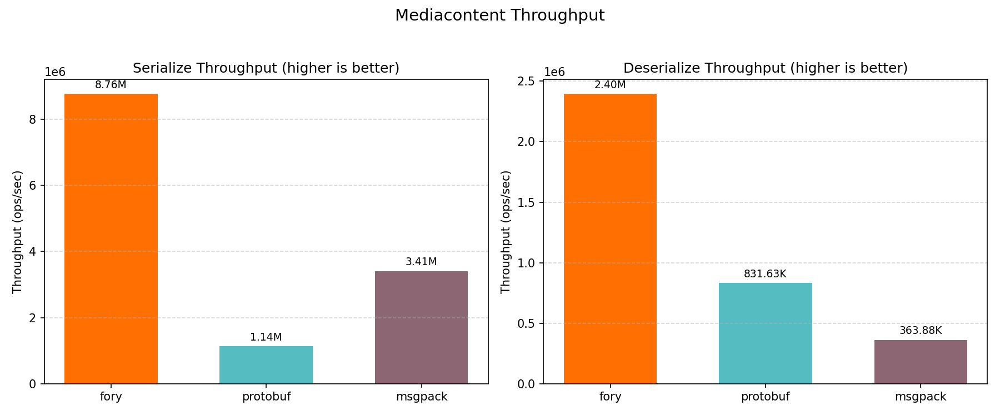
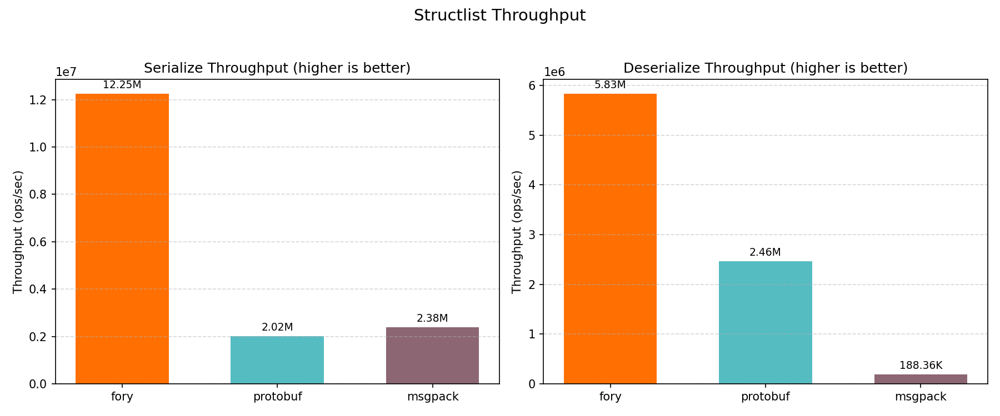
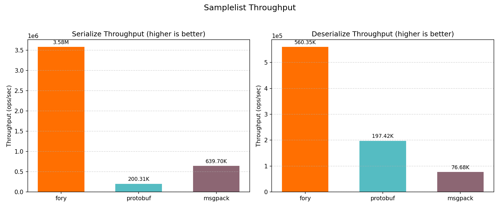
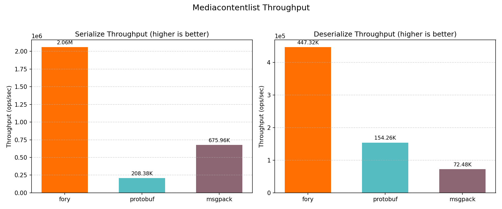

# C++ Benchmark Performance Report

_Generated on 2026-05-08 03:30:03_

## How to Generate This Report

```bash
cd benchmarks/cpp/build
./fory_benchmark --benchmark_format=json --benchmark_out=benchmark_results.json
cd ..
python benchmark_report.py --json-file build/benchmark_results.json --output-dir report
```

## Hardware & OS Info

| Key                        | Value                     |
| -------------------------- | ------------------------- |
| OS                         | Darwin 24.6.0             |
| Machine                    | arm64                     |
| Processor                  | arm                       |
| CPU Cores (Physical)       | 12                        |
| CPU Cores (Logical)        | 12                        |
| Total RAM (GB)             | 48.0                      |
| Benchmark Date             | 2026-05-08T03:29:26+08:00 |
| CPU Cores (from benchmark) | 12                        |

## Benchmark Plots

All class-level plots below show throughput (ops/sec).

### Throughput


### NumericStruct



### Sample



### MediaContent



### NumericStructList



### SampleList



### MediaContentList



## Benchmark Results

### Timing Results (nanoseconds)

| Datatype          | Operation   | fory (ns) | protobuf (ns) | msgpack (ns) | Fastest |
| ----------------- | ----------- | --------- | ------------- | ------------ | ------- |
| NumericStruct     | Serialize   | 23.6      | 48.9          | 81.8         | fory    |
| NumericStruct     | Deserialize | 25.7      | 32.4          | 1171.3       | fory    |
| Sample            | Serialize   | 62.0      | 96.1          | 308.3        | fory    |
| Sample            | Deserialize | 329.1     | 678.9         | 2712.6       | fory    |
| MediaContent      | Serialize   | 114.2     | 878.1         | 293.4        | fory    |
| MediaContent      | Deserialize | 417.4     | 1202.5        | 2748.2       | fory    |
| NumericStructList | Serialize   | 81.7      | 495.5         | 419.7        | fory    |
| NumericStructList | Deserialize | 171.5     | 405.8         | 5309.0       | fory    |
| SampleList        | Serialize   | 279.3     | 4992.3        | 1563.2       | fory    |
| SampleList        | Deserialize | 1784.6    | 5065.2        | 13040.9      | fory    |
| MediaContentList  | Serialize   | 485.3     | 4798.9        | 1479.4       | fory    |
| MediaContentList  | Deserialize | 2235.5    | 6482.6        | 13797.8      | fory    |

### Throughput Results (ops/sec)

| Datatype          | Operation   | fory TPS   | protobuf TPS | msgpack TPS | Fastest |
| ----------------- | ----------- | ---------- | ------------ | ----------- | ------- |
| NumericStruct     | Serialize   | 42,340,747 | 20,456,013   | 12,223,421  | fory    |
| NumericStruct     | Deserialize | 38,921,757 | 30,876,920   | 853,731     | fory    |
| Sample            | Serialize   | 16,120,239 | 10,402,361   | 3,243,915   | fory    |
| Sample            | Deserialize | 3,038,551  | 1,473,035    | 368,652     | fory    |
| MediaContent      | Serialize   | 8,760,221  | 1,138,812    | 3,408,303   | fory    |
| MediaContent      | Deserialize | 2,395,697  | 831,626      | 363,876     | fory    |
| NumericStructList | Serialize   | 12,246,425 | 2,018,049    | 2,382,679   | fory    |
| NumericStructList | Deserialize | 5,829,352  | 2,464,295    | 188,358     | fory    |
| SampleList        | Serialize   | 3,579,741  | 200,307      | 639,695     | fory    |
| SampleList        | Deserialize | 560,346    | 197,425      | 76,682      | fory    |
| MediaContentList  | Serialize   | 2,060,531  | 208,381      | 675,956     | fory    |
| MediaContentList  | Deserialize | 447,319    | 154,259      | 72,475      | fory    |

### Serialized Data Sizes (bytes)

| Datatype          | fory | protobuf | msgpack |
| ----------------- | ---- | -------- | ------- |
| NumericStruct     | 78   | 93       | 87      |
| Sample            | 445  | 375      | 530     |
| MediaContent      | 362  | 301      | 480     |
| NumericStructList | 255  | 475      | 449     |
| SampleList        | 1978 | 1890     | 2664    |
| MediaContentList  | 1531 | 1520     | 2421    |
