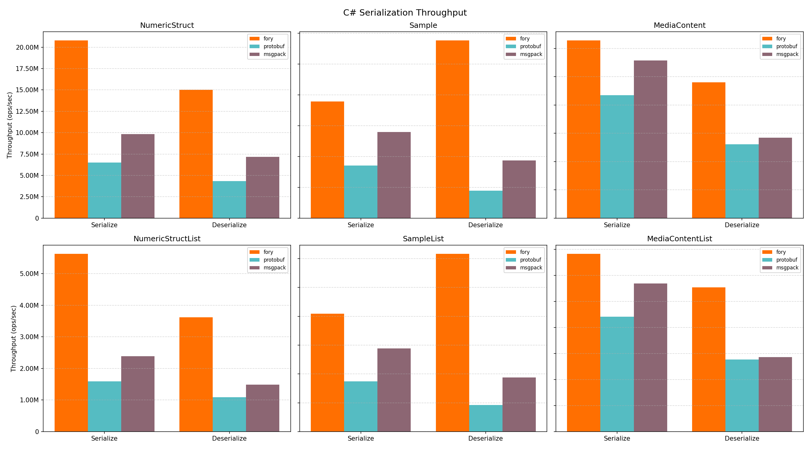
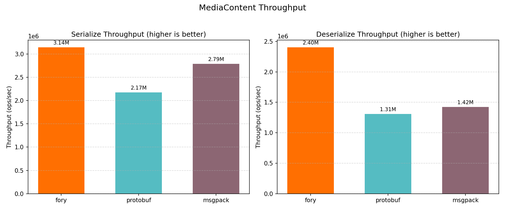
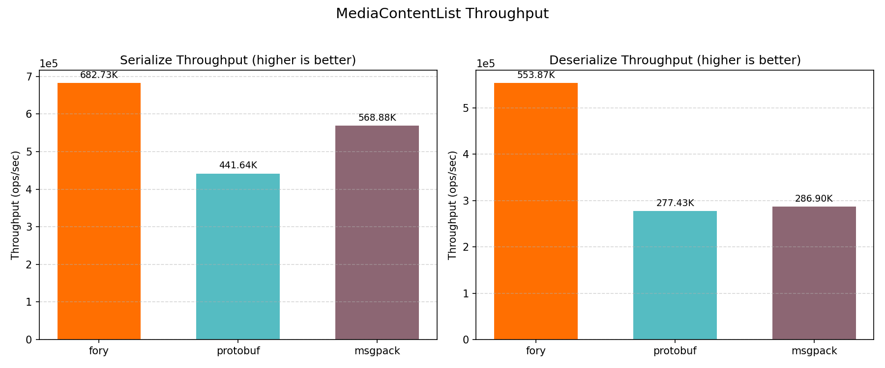
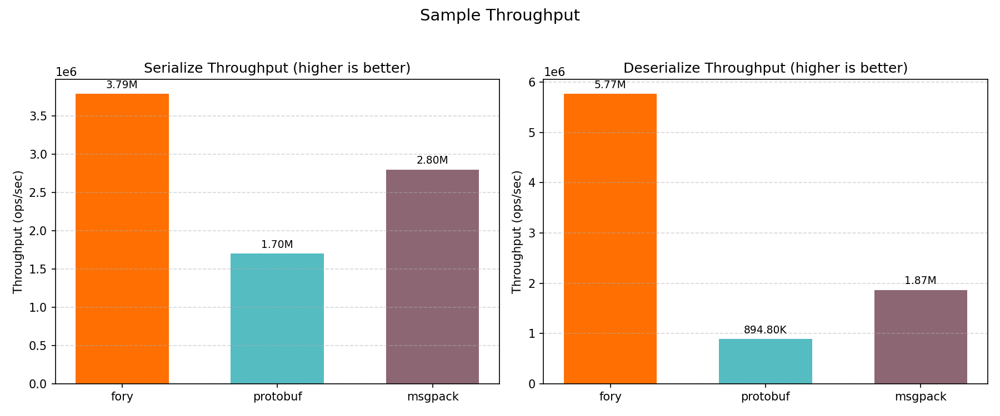
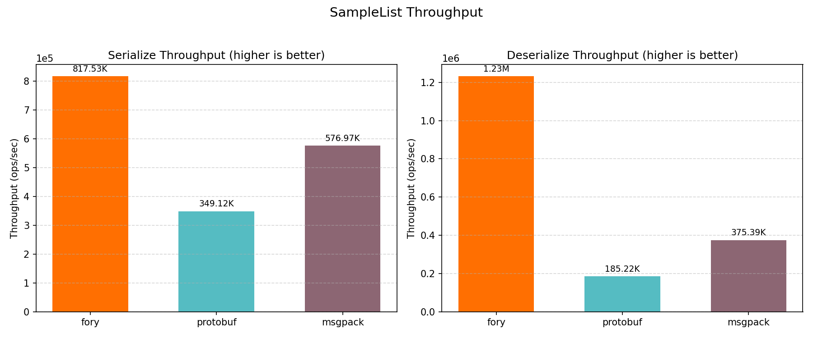
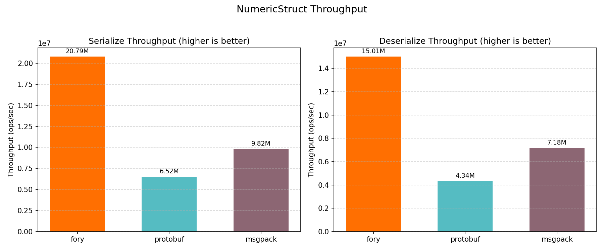
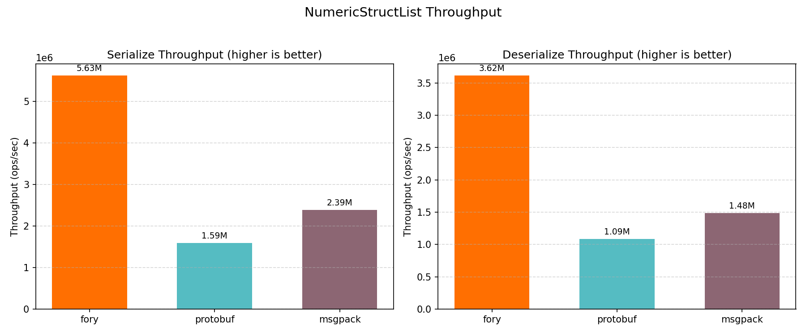

# C# Benchmark Performance Report

_Generated on 2026-05-08 03:33:12_

## How to Generate This Report

```bash
cd benchmarks/csharp
dotnet run -c Release --project ./Fory.CSharpBenchmark.csproj -- --output build/benchmark_results.json
python3 benchmark_report.py --json-file build/benchmark_results.json --output-dir report
```

## Hardware & OS Info

| Key                                | Value                                                                                                                        |
| ---------------------------------- | ---------------------------------------------------------------------------------------------------------------------------- |
| OS                                 | Darwin 24.6.0 Darwin Kernel Version 24.6.0: Wed Oct 15 21:12:15 PDT 2025; root:xnu-11417.140.69.703.14~1/RELEASE_ARM64_T6041 |
| OS Architecture                    | Arm64                                                                                                                        |
| Machine                            | Arm64                                                                                                                        |
| Runtime Version                    | 8.0.24                                                                                                                       |
| Benchmark Date (UTC)               | 2026-05-07T19:33:11.3470280Z                                                                                                 |
| Warmup Seconds                     | 1                                                                                                                            |
| Duration Seconds                   | 3                                                                                                                            |
| CPU Logical Cores (from benchmark) | 12                                                                                                                           |
| CPU Cores (Physical)               | 12                                                                                                                           |
| CPU Cores (Logical)                | 12                                                                                                                           |
| Total RAM (GB)                     | 48.0                                                                                                                         |

## Benchmark Coverage

| Key                 | Value                                                                  |
| ------------------- | ---------------------------------------------------------------------- |
| Cases in input JSON | 36 / 36                                                                |
| Serializers         | fory, msgpack, protobuf                                                |
| Datatypes           | struct, sample, mediacontent, structlist, samplelist, mediacontentlist |
| Operations          | serialize, deserialize                                                 |

## Benchmark Plots

All class-level plots below show throughput (ops/sec).

### Throughput



### MediaContent



### MediaContentList



### Sample



### SampleList



### NumericStruct



### NumericStructList



## Benchmark Results

### Timing Results (nanoseconds)

| Datatype          | Operation   | fory (ns) | protobuf (ns) | msgpack (ns) | Fastest |
| ----------------- | ----------- | --------- | ------------- | ------------ | ------- |
| NumericStruct     | Serialize   | 48.1      | 153.4         | 101.8        | fory    |
| NumericStruct     | Deserialize | 66.6      | 230.5         | 139.2        | fory    |
| Sample            | Serialize   | 264.2     | 587.4         | 357.5        | fory    |
| Sample            | Deserialize | 173.4     | 1117.6        | 535.4        | fory    |
| MediaContent      | Serialize   | 318.4     | 460.0         | 358.7        | fory    |
| MediaContent      | Deserialize | 416.4     | 765.3         | 702.2        | fory    |
| NumericStructList | Serialize   | 177.8     | 627.9         | 418.7        | fory    |
| NumericStructList | Deserialize | 276.6     | 921.6         | 673.6        | fory    |
| SampleList        | Serialize   | 1223.2    | 2864.3        | 1733.2       | fory    |
| SampleList        | Deserialize | 811.7     | 5398.9        | 2663.9       | fory    |
| MediaContentList  | Serialize   | 1464.7    | 2264.3        | 1757.8       | fory    |
| MediaContentList  | Deserialize | 1805.5    | 3604.5        | 3485.5       | fory    |

### Throughput Results (ops/sec)

| Datatype          | Operation   | fory TPS   | protobuf TPS | msgpack TPS | Fastest |
| ----------------- | ----------- | ---------- | ------------ | ----------- | ------- |
| NumericStruct     | Serialize   | 20,789,902 | 6,517,124    | 9,824,350   | fory    |
| NumericStruct     | Deserialize | 15,012,843 | 4,337,643    | 7,182,355   | fory    |
| Sample            | Serialize   | 3,785,458  | 1,702,392    | 2,797,102   | fory    |
| Sample            | Deserialize | 5,765,682  | 894,796      | 1,867,599   | fory    |
| MediaContent      | Serialize   | 3,141,058  | 2,173,936    | 2,787,836   | fory    |
| MediaContent      | Deserialize | 2,401,552  | 1,306,689    | 1,424,121   | fory    |
| NumericStructList | Serialize   | 5,625,375  | 1,592,535    | 2,388,188   | fory    |
| NumericStructList | Deserialize | 3,615,288  | 1,085,025    | 1,484,484   | fory    |
| SampleList        | Serialize   | 817,528    | 349,125      | 576,972     | fory    |
| SampleList        | Deserialize | 1,231,958  | 185,223      | 375,385     | fory    |
| MediaContentList  | Serialize   | 682,734    | 441,639      | 568,884     | fory    |
| MediaContentList  | Deserialize | 553,871    | 277,432      | 286,900     | fory    |

### Serialized Data Sizes (bytes)

| Datatype          | fory | protobuf | msgpack |
| ----------------- | ---- | -------- | ------- |
| NumericStruct     | 78   | 93       | 87      |
| Sample            | 445  | 460      | 562     |
| MediaContent      | 362  | 307      | 479     |
| NumericStructList | 255  | 475      | 444     |
| SampleList        | 1978 | 2315     | 2819    |
| MediaContentList  | 1531 | 1550     | 2404    |
