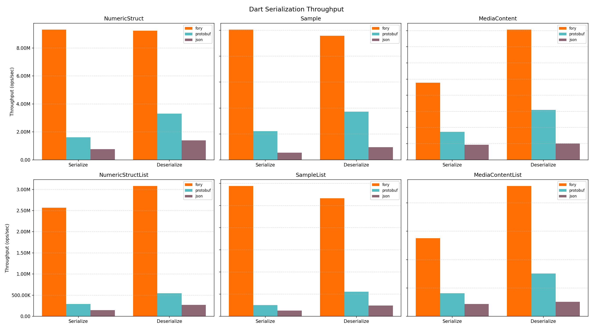
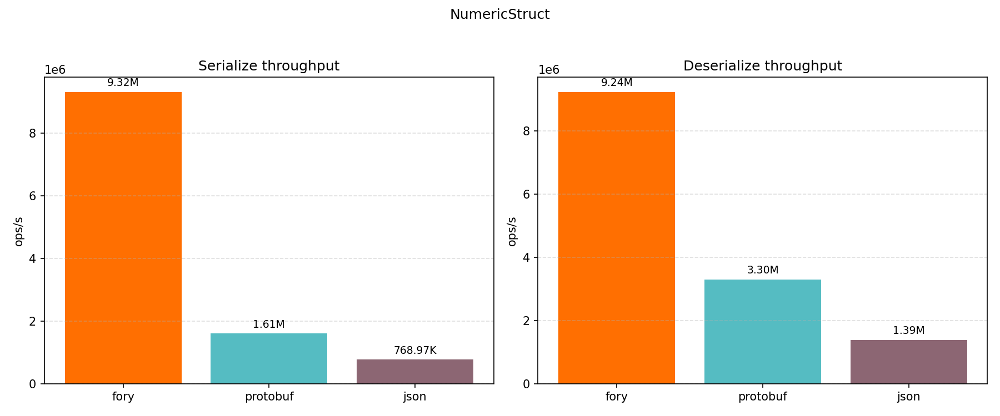
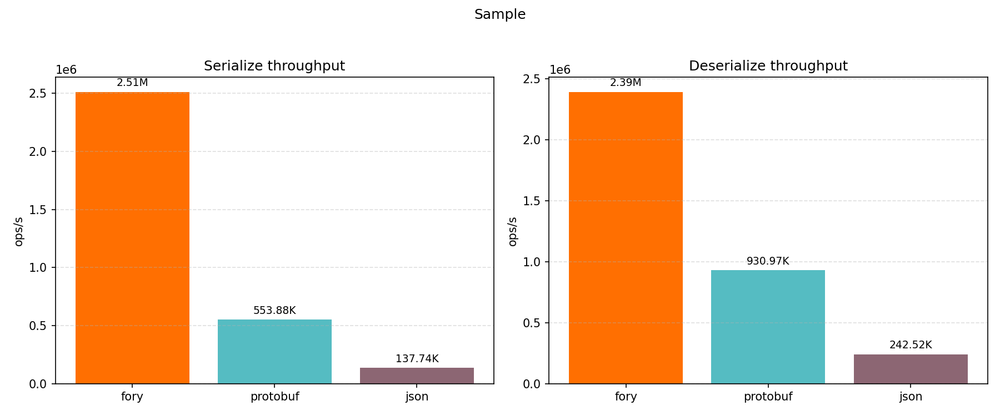
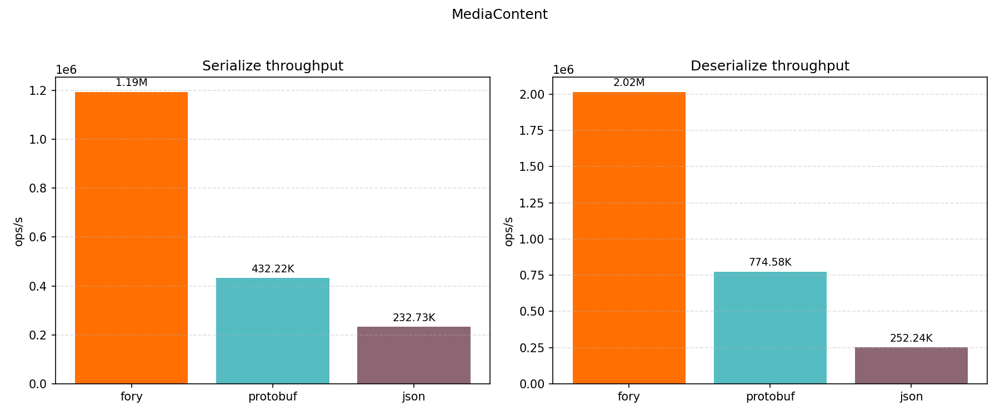
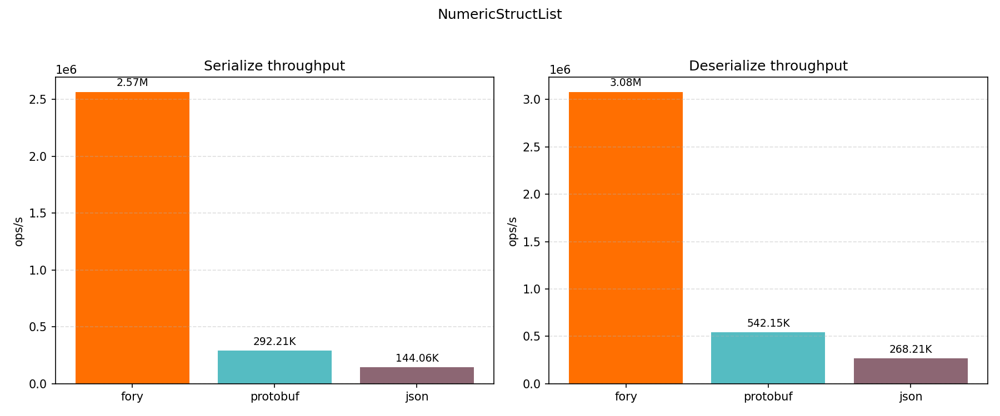
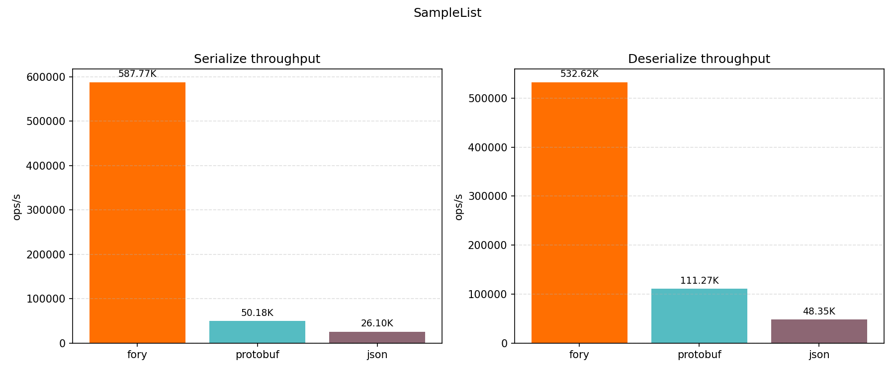
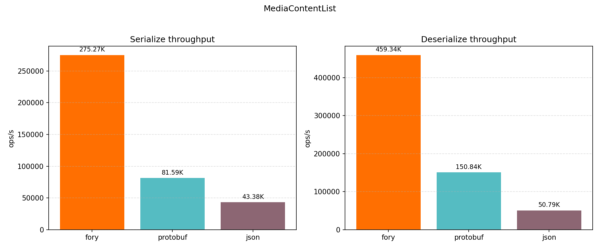

# Fory Dart Benchmark

This benchmark compares serialization and deserialization throughput for Apache Fory, Protocol Buffers, and JSON in Dart.

## Hardware and Runtime Info

| Key                   | Value                                                             |
| --------------------- | ----------------------------------------------------------------- |
| Timestamp             | 2026-05-07T19:42:18.589207Z                                       |
| OS                    | Version 15.7.2 (Build 24G325)                                     |
| Host                  | MacBook-Pro.local                                                 |
| CPU Cores (Logical)   | 12                                                                |
| Memory (GB)           | 48.00                                                             |
| Dart                  | 3.10.7 (stable) (Tue Dec 23 00:01:57 2025 -0800) on "macos_arm64" |
| Samples per case      | 5                                                                 |
| Warmup per case (s)   | 1.0                                                               |
| Duration per case (s) | 1.5                                                               |

## Throughput Results

| Datatype          | Operation   |  Fory TPS | Protobuf TPS |  JSON TPS | Fastest       |
| ----------------- | ----------- | --------: | -----------: | --------: | ------------- |
| NumericStruct     | Serialize   | 9,315,764 |    1,609,183 |   768,972 | fory (5.79x)  |
| NumericStruct     | Deserialize | 9,239,326 |    3,304,725 | 1,392,396 | fory (2.80x)  |
| Sample            | Serialize   | 2,513,144 |      553,880 |   137,741 | fory (4.54x)  |
| Sample            | Deserialize | 2,394,927 |      930,969 |   242,522 | fory (2.57x)  |
| MediaContent      | Serialize   | 1,193,789 |      432,224 |   232,731 | fory (2.76x)  |
| MediaContent      | Deserialize | 2,015,704 |      774,578 |   252,242 | fory (2.60x)  |
| NumericStructList | Serialize   | 2,565,386 |      292,207 |   144,065 | fory (8.78x)  |
| NumericStructList | Deserialize | 3,079,355 |      542,152 |   268,213 | fory (5.68x)  |
| SampleList        | Serialize   |   587,773 |       50,180 |    26,101 | fory (11.71x) |
| SampleList        | Deserialize |   532,619 |      111,270 |    48,355 | fory (4.79x)  |
| MediaContentList  | Serialize   |   275,271 |       81,587 |    43,376 | fory (3.37x)  |
| MediaContentList  | Deserialize |   459,335 |      150,838 |    50,792 | fory (3.05x)  |

## Serialized Size (bytes)

| Datatype          | Fory | Protobuf | JSON |
| ----------------- | ---: | -------: | ---: |
| NumericStruct     |   78 |       93 |  159 |
| Sample            |  445 |      377 |  791 |
| MediaContent      |  362 |      307 |  619 |
| NumericStructList |  255 |      475 |  816 |
| SampleList        | 1978 |     1900 | 3976 |
| MediaContentList  | 1531 |     1550 | 3122 |

## Per-workload Plots

### NumericStruct

### Sample

### MediaContent

### NumericStructList

### SampleList

### MediaContentList

