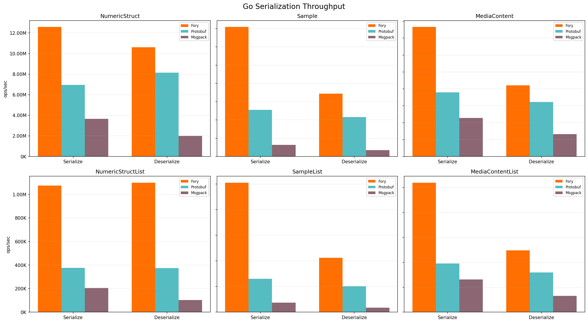
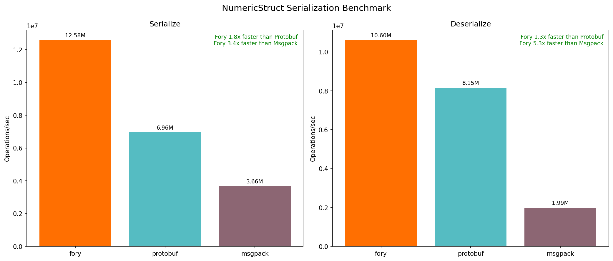
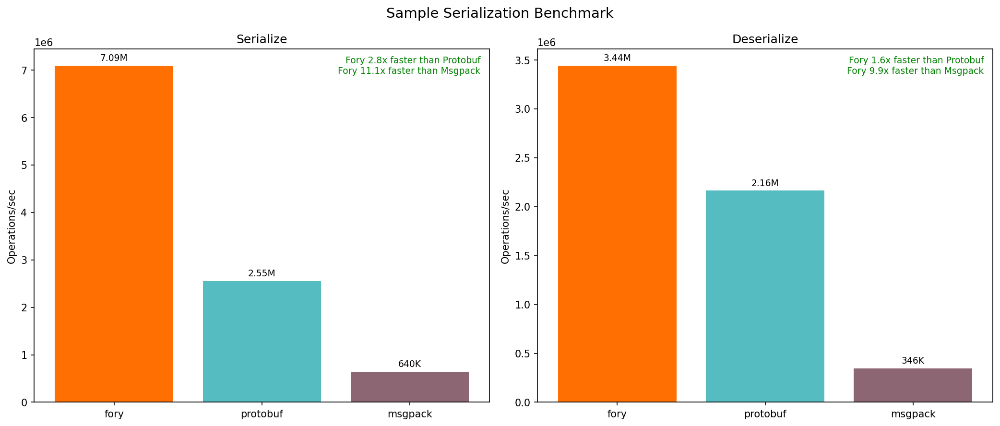
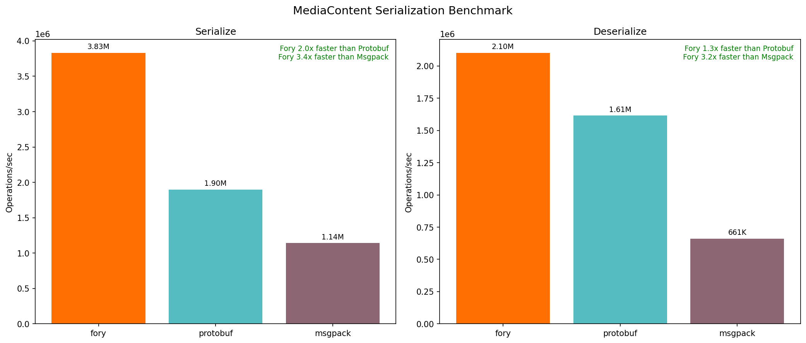
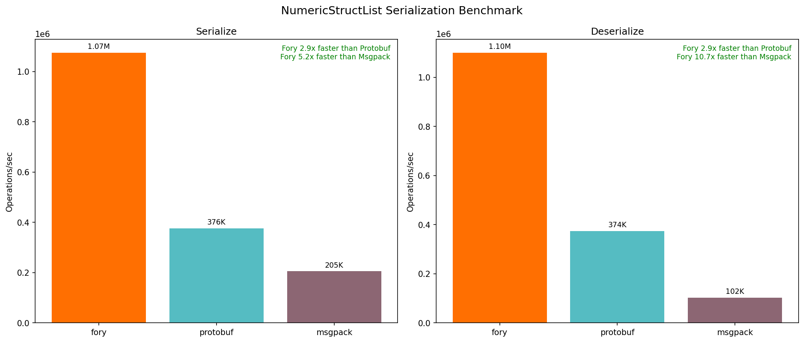
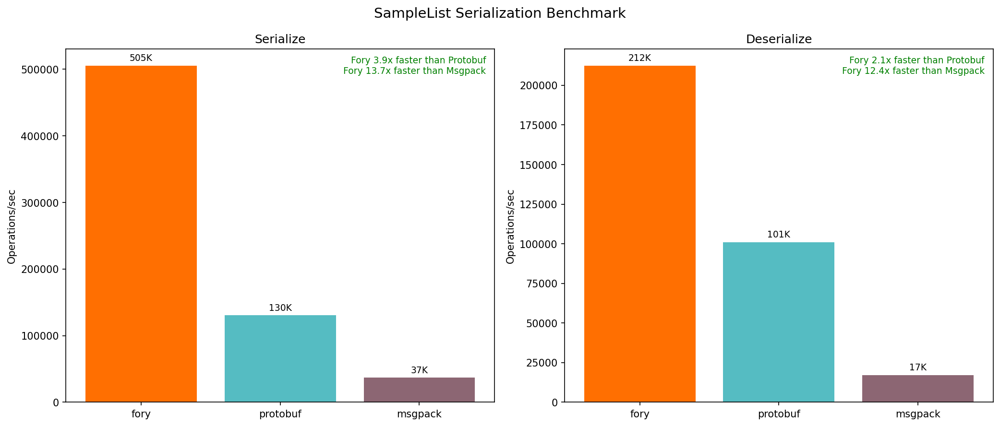
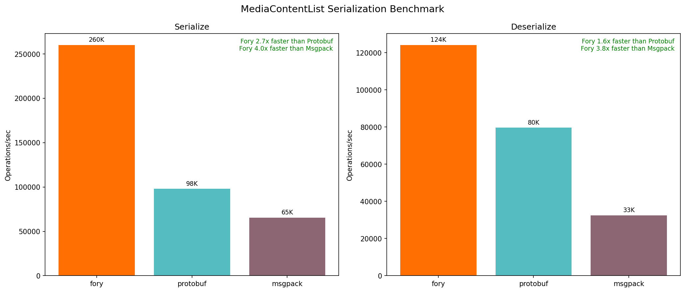

# Go Serialization Benchmark Report

Generated: 2026-05-08 03:21:36

## System Information

- **OS**: Darwin 24.6.0
- **Architecture**: arm64
- **Python**: 3.9.6

## Performance Summary

| Data Type         | Operation   | Fory (ops/s) | Protobuf (ops/s) | Msgpack (ops/s) | Fory vs PB | Fory vs MP |
| ----------------- | ----------- | ------------ | ---------------- | --------------- | ---------- | ---------- |
| NumericStruct     | Serialize   | 12.58M       | 6.96M            | 3.66M           | 1.81x      | 3.43x      |
| NumericStruct     | Deserialize | 10.60M       | 8.15M            | 1.99M           | 1.30x      | 5.32x      |
| Sample            | Serialize   | 7.09M        | 2.55M            | 640K            | 2.78x      | 11.08x     |
| Sample            | Deserialize | 3.44M        | 2.16M            | 346K            | 1.59x      | 9.93x      |
| MediaContent      | Serialize   | 3.83M        | 1.90M            | 1.14M           | 2.02x      | 3.36x      |
| MediaContent      | Deserialize | 2.10M        | 1.61M            | 661K            | 1.30x      | 3.18x      |
| NumericStructList | Serialize   | 1.07M        | 376K             | 205K            | 2.86x      | 5.23x      |
| NumericStructList | Deserialize | 1.10M        | 374K             | 102K            | 2.94x      | 10.74x     |
| SampleList        | Serialize   | 505K         | 130K             | 37K             | 3.88x      | 13.73x     |
| SampleList        | Deserialize | 212K         | 101K             | 17K             | 2.10x      | 12.40x     |
| MediaContentList  | Serialize   | 260K         | 98K              | 65K             | 2.66x      | 3.97x      |
| MediaContentList  | Deserialize | 124K         | 80K              | 33K             | 1.56x      | 3.82x      |

## Detailed Timing (ns/op)

| Data Type         | Operation   | Fory   | Protobuf | Msgpack |
| ----------------- | ----------- | ------ | -------- | ------- |
| NumericStruct     | Serialize   | 79.5   | 143.7    | 273.0   |
| NumericStruct     | Deserialize | 94.3   | 122.7    | 501.7   |
| Sample            | Serialize   | 141.0  | 391.7    | 1562.0  |
| Sample            | Deserialize | 290.6  | 462.2    | 2887.0  |
| MediaContent      | Serialize   | 261.1  | 526.8    | 876.5   |
| MediaContent      | Deserialize | 476.0  | 619.4    | 1513.0  |
| NumericStructList | Serialize   | 930.6  | 2661.0   | 4868.0  |
| NumericStructList | Deserialize | 909.3  | 2675.0   | 9767.0  |
| SampleList        | Serialize   | 1979.0 | 7671.0   | 27168.0 |
| SampleList        | Deserialize | 4709.0 | 9893.0   | 58414.0 |
| MediaContentList  | Serialize   | 3846.0 | 10212.0  | 15272.0 |
| MediaContentList  | Deserialize | 8055.0 | 12552.0  | 30730.0 |

### Serialized Data Sizes (bytes)

| Data Type         | Fory | Protobuf | Msgpack |
| ----------------- | ---- | -------- | ------- |
| NumericStruct     | 78   | 93       | 88      |
| Sample            | 445  | 375      | 524     |
| MediaContent      | 340  | 301      | 400     |
| NumericStructList | 819  | 1900     | 1766    |
| SampleList        | 7599 | 7560     | 10486   |
| MediaContentList  | 5774 | 6080     | 8006    |

## Performance Charts

### Throughput

### NumericStruct

### Sample

### MediaContent

### NumericStructList

### SampleList

### MediaContentList

