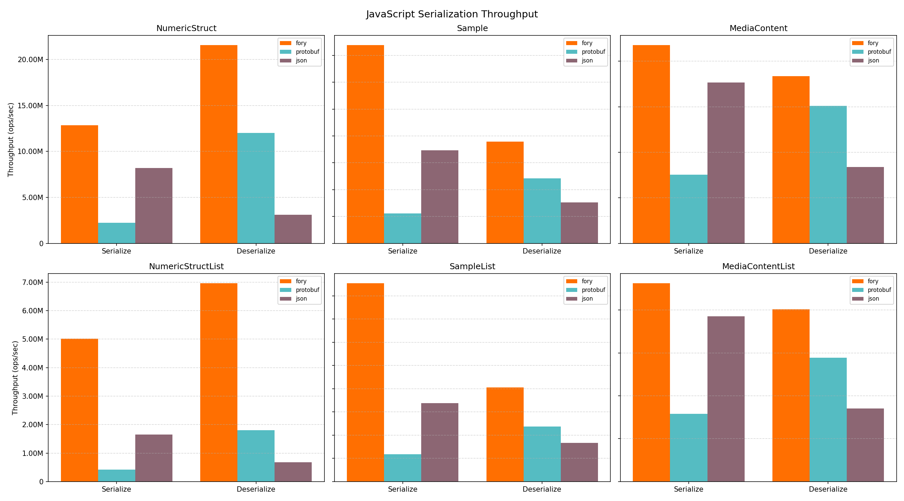
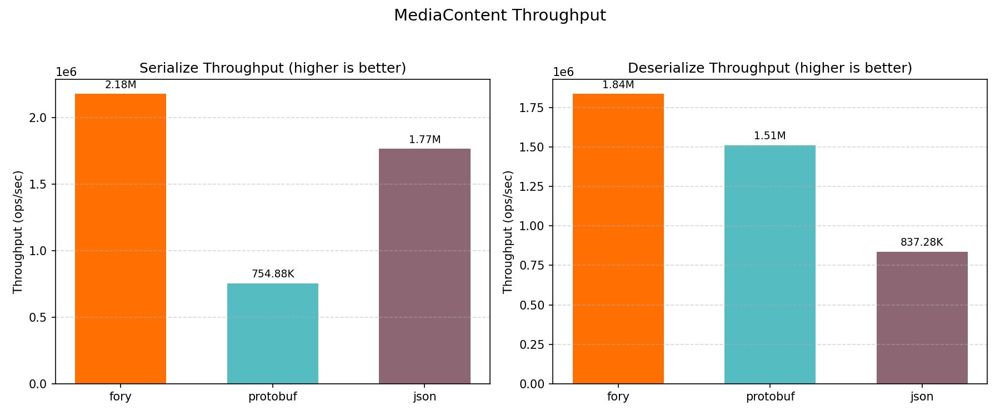
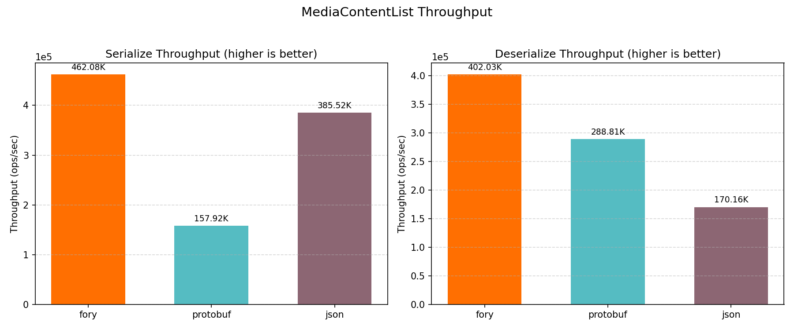
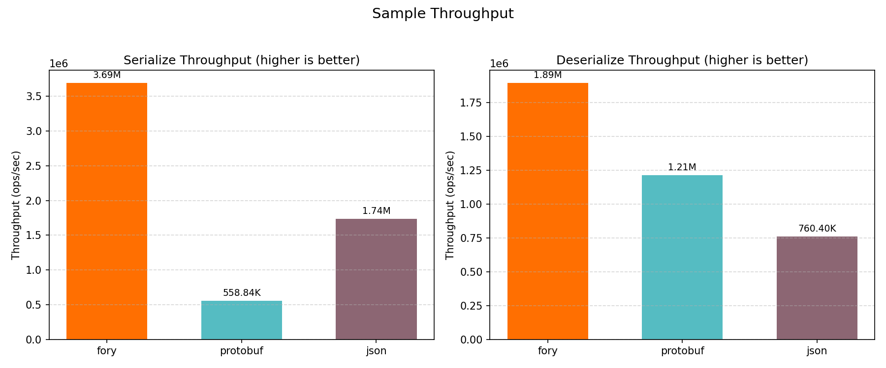
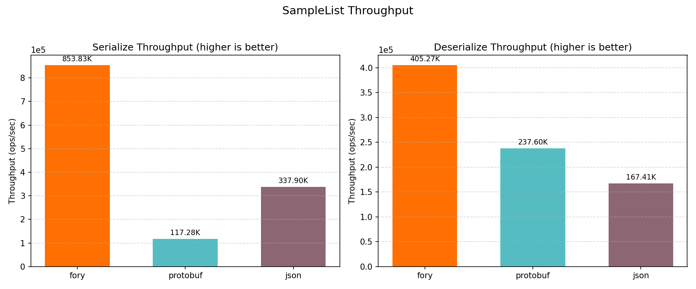
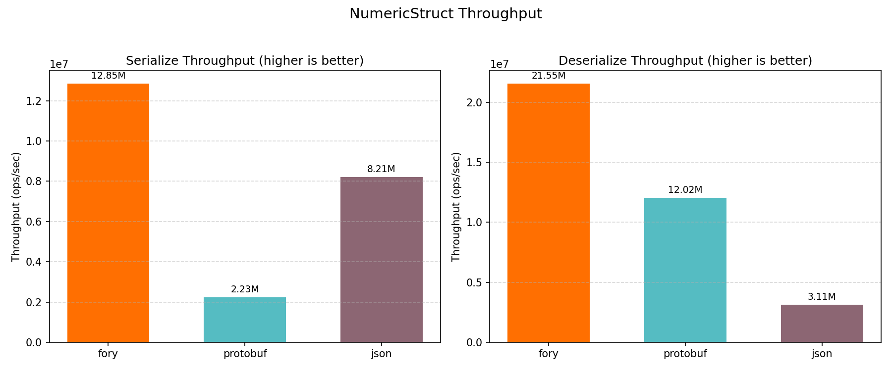
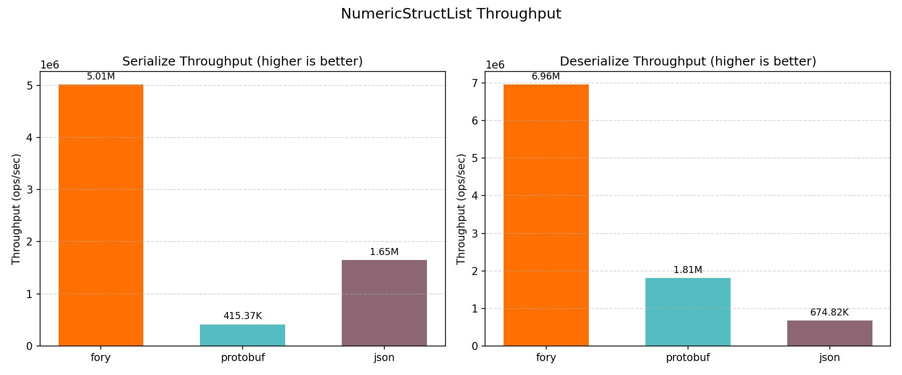

# JavaScript Benchmark Performance Report

_Generated on 2026-05-08 11:29:18_

## How to Generate This Report

```bash
cd benchmarks/javascript
./run.sh
```

## Benchmark Semantics

The timed serializer loops use serializer-native typed values. Fory receives the pre-normalized Fory value used by its schema, protobuf receives the prebuilt protobuf-shaped value, and JSON receives the benchmark JavaScript object. Protobuf timings do not include `toProto`, `fromProto`, `protobufjs.create`, or `toObject` conversion work.

## Hardware & OS Info

| Key                        | Value                    |
| -------------------------- | ------------------------ |
| OS                         | Darwin 24.6.0            |
| Machine                    | arm64                    |
| Processor                  | arm                      |
| CPU Cores (Physical)       | 12                       |
| CPU Cores (Logical)        | 12                       |
| Total RAM (GB)             | 48.0                     |
| Benchmark Date             | 2026-05-08T03:27:27.670Z |
| CPU Cores (from benchmark) | 12                       |
| Node.js                    | v25.8.1                  |
| V8                         | 14.1.146.11-node.21      |

## Benchmark Plots

All class-level plots below show throughput (ops/sec).

### Throughput



### MediaContent



### MediaContentList



### Sample



### SampleList



### NumericStruct



### NumericStructList



## Benchmark Results

### Timing Results (nanoseconds)

| Datatype          | Operation   | fory (ns) | protobuf (ns) | json (ns) | Fastest |
| ----------------- | ----------- | --------- | ------------- | --------- | ------- |
| NumericStruct     | Serialize   | 77.8      | 447.6         | 121.8     | fory    |
| NumericStruct     | Deserialize | 46.4      | 83.2          | 321.6     | fory    |
| Sample            | Serialize   | 270.9     | 1789.4        | 576.2     | fory    |
| Sample            | Deserialize | 528.3     | 824.3         | 1315.1    | fory    |
| MediaContent      | Serialize   | 459.4     | 1324.7        | 566.5     | fory    |
| MediaContent      | Deserialize | 544.6     | 661.9         | 1194.3    | fory    |
| NumericStructList | Serialize   | 199.5     | 2407.5        | 606.6     | fory    |
| NumericStructList | Deserialize | 143.7     | 552.3         | 1481.9    | fory    |
| SampleList        | Serialize   | 1171.2    | 8526.9        | 2959.5    | fory    |
| SampleList        | Deserialize | 2467.5    | 4208.7        | 5973.5    | fory    |
| MediaContentList  | Serialize   | 2164.1    | 6332.4        | 2593.9    | fory    |
| MediaContentList  | Deserialize | 2487.4    | 3462.5        | 5877.0    | fory    |

### Throughput Results (ops/sec)

| Datatype          | Operation   | fory TPS   | protobuf TPS | json TPS  | Fastest |
| ----------------- | ----------- | ---------- | ------------ | --------- | ------- |
| NumericStruct     | Serialize   | 12,849,851 | 2,234,166    | 8,208,279 | fory    |
| NumericStruct     | Deserialize | 21,547,808 | 12,017,233   | 3,109,551 | fory    |
| Sample            | Serialize   | 3,690,917  | 558,841      | 1,735,442 | fory    |
| Sample            | Deserialize | 1,892,771  | 1,213,083    | 760,401   | fory    |
| MediaContent      | Serialize   | 2,176,977  | 754,884      | 1,765,218 | fory    |
| MediaContent      | Deserialize | 1,836,161  | 1,510,915    | 837,278   | fory    |
| NumericStructList | Serialize   | 5,013,481  | 415,368      | 1,648,437 | fory    |
| NumericStructList | Deserialize | 6,958,482  | 1,810,451    | 674,822   | fory    |
| SampleList        | Serialize   | 853,833    | 117,276      | 337,895   | fory    |
| SampleList        | Deserialize | 405,267    | 237,605      | 167,406   | fory    |
| MediaContentList  | Serialize   | 462,077    | 157,919      | 385,519   | fory    |
| MediaContentList  | Deserialize | 402,028    | 288,809      | 170,156   | fory    |

### Serialized Data Sizes (bytes)

| Datatype          | fory | protobuf | json |
| ----------------- | ---- | -------- | ---- |
| NumericStruct     | 78   | 93       | 159  |
| Sample            | 445  | 377      | 724  |
| MediaContent      | 388  | 307      | 596  |
| NumericStructList | 255  | 475      | 817  |
| SampleList        | 1978 | 1900     | 3642 |
| MediaContentList  | 1661 | 1550     | 3009 |
