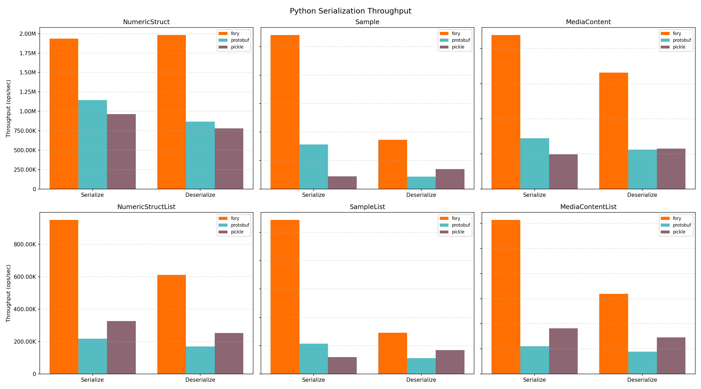
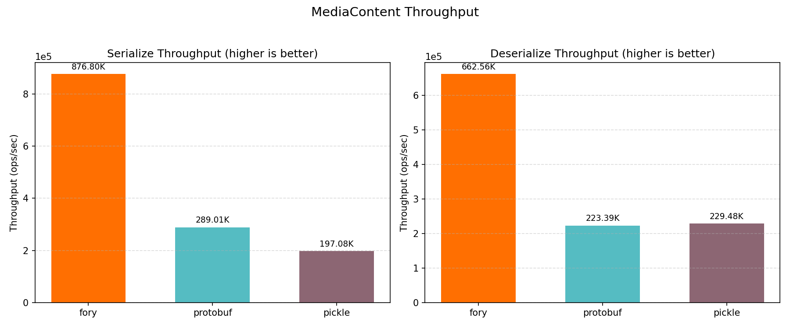
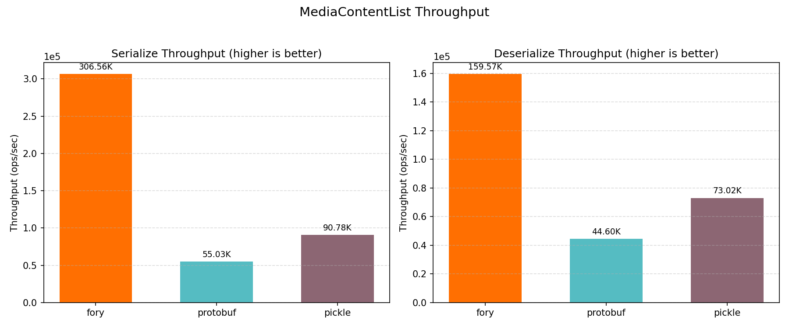
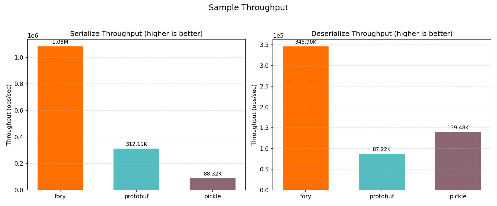
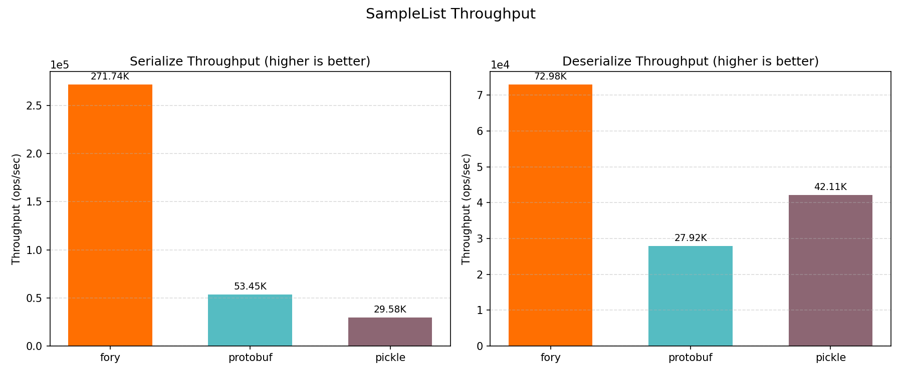
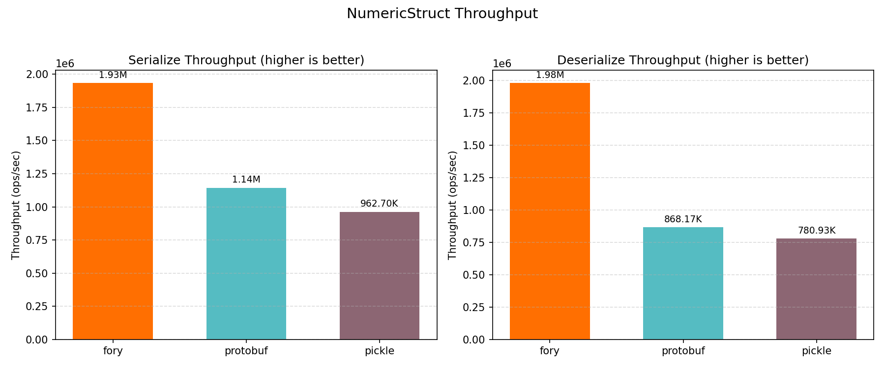
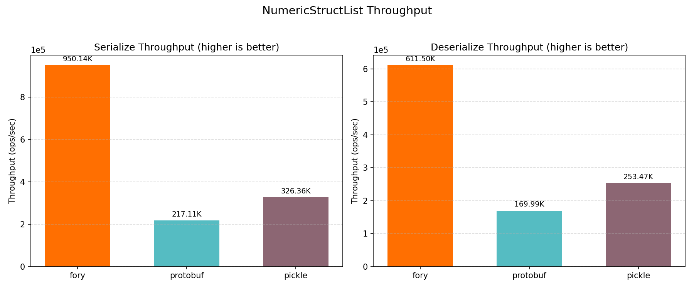

# Python Benchmark Performance Report

_Generated on 2026-05-08 11:35:12_

## How to Generate This Report

```bash
cd benchmarks/python
./run.sh
```

## Hardware & OS Info

| Key                   | Value                        |
| --------------------- | ---------------------------- |
| OS                    | Darwin 24.6.0                |
| Machine               | arm64                        |
| Processor             | arm                          |
| Python                | 3.10.8                       |
| CPU Cores (Physical)  | 12                           |
| CPU Cores (Logical)   | 12                           |
| Total RAM (GB)        | 48.0                         |
| Python Implementation | CPython                      |
| Benchmark Platform    | macOS-15.7.2-arm64-arm-64bit |

## Benchmark Configuration

| Key        | Value |
| ---------- | ----- |
| warmup     | 3     |
| iterations | 15    |
| repeat     | 5     |
| number     | 1000  |
| list_size  | 5     |

## Benchmark Plots

All plots show throughput (ops/sec); higher is better.

### Throughput



### MediaContent



### MediaContentList



### Sample



### SampleList



### NumericStruct



### NumericStructList



## Benchmark Results

### Timing Results (nanoseconds)

| Datatype          | Operation   | fory (ns) | protobuf (ns) | pickle (ns) | Fastest |
| ----------------- | ----------- | --------- | ------------- | ----------- | ------- |
| NumericStruct     | Serialize   | 517.0     | 873.6         | 1038.7      | fory    |
| NumericStruct     | Deserialize | 504.6     | 1151.9        | 1280.5      | fory    |
| Sample            | Serialize   | 924.4     | 3204.0        | 11322.5     | fory    |
| Sample            | Deserialize | 2891.0    | 11464.7       | 7169.7      | fory    |
| MediaContent      | Serialize   | 1140.5    | 3460.1        | 5074.0      | fory    |
| MediaContent      | Deserialize | 1509.3    | 4476.4        | 4357.6      | fory    |
| NumericStructList | Serialize   | 1052.5    | 4606.0        | 3064.1      | fory    |
| NumericStructList | Deserialize | 1635.3    | 5882.8        | 3945.2      | fory    |
| SampleList        | Serialize   | 3680.0    | 18709.4       | 33800.9     | fory    |
| SampleList        | Deserialize | 13702.0   | 35818.0       | 23745.4     | fory    |
| MediaContentList  | Serialize   | 3262.0    | 18170.7       | 11015.9     | fory    |
| MediaContentList  | Deserialize | 6267.0    | 22423.2       | 13695.5     | fory    |

### Throughput Results (ops/sec)

| Datatype          | Operation   | fory TPS  | protobuf TPS | pickle TPS | Fastest |
| ----------------- | ----------- | --------- | ------------ | ---------- | ------- |
| NumericStruct     | Serialize   | 1,934,203 | 1,144,735    | 962,697    | fory    |
| NumericStruct     | Deserialize | 1,981,615 | 868,166      | 780,935    | fory    |
| Sample            | Serialize   | 1,081,792 | 312,107      | 88,320     | fory    |
| Sample            | Deserialize | 345,897   | 87,224       | 139,476    | fory    |
| MediaContent      | Serialize   | 876,796   | 289,005      | 197,082    | fory    |
| MediaContent      | Deserialize | 662,558   | 223,395      | 229,483    | fory    |
| NumericStructList | Serialize   | 950,145   | 217,108      | 326,363    | fory    |
| NumericStructList | Deserialize | 611,499   | 169,986      | 253,472    | fory    |
| SampleList        | Serialize   | 271,739   | 53,449       | 29,585     | fory    |
| SampleList        | Deserialize | 72,982    | 27,919       | 42,114     | fory    |
| MediaContentList  | Serialize   | 306,557   | 55,034       | 90,778     | fory    |
| MediaContentList  | Deserialize | 159,565   | 44,597       | 73,017     | fory    |

### Serialized Data Sizes (bytes)

| Datatype          | fory | protobuf | pickle |
| ----------------- | ---- | -------- | ------ |
| NumericStruct     | 78   | 93       | 169    |
| Sample            | 445  | 375      | 1176   |
| MediaContent      | 366  | 301      | 624    |
| NumericStructList | 219  | 475      | 582    |
| SampleList        | 1914 | 1890     | 3546   |
| MediaContentList  | 1614 | 1520     | 1415   |
