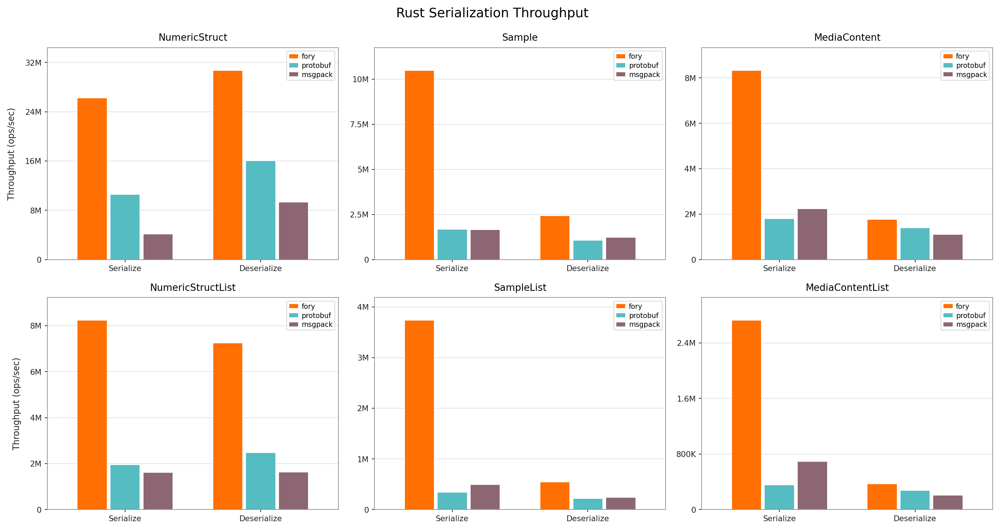

# Rust Benchmark Performance Report

_Generated on 2026-05-08 17:27:11_

## How to Generate This Report

```bash
cd benchmarks/rust
cargo bench --bench serialization_bench 2>&1 | tee results/cargo_bench.log
cargo run --release --bin fory_profiler -- --print-all-serialized-sizes | tee results/serialized_sizes.txt
python benchmark_report.py --log-file results/cargo_bench.log --size-file results/serialized_sizes.txt --output-dir results
```

## Benchmark Plot

The plot shows throughput (ops/sec); higher is better.



## Hardware & OS Info

| Key                  | Value               |
| -------------------- | ------------------- |
| OS                   | Darwin 24.6.0       |
| Machine              | arm64               |
| Processor            | arm                 |
| CPU Cores (Physical) | 12                  |
| CPU Cores (Logical)  | 12                  |
| Total RAM (GB)       | 48.0                |
| Benchmark Date       | 2026-05-08T16:47:49 |

## Benchmark Results

### Timing Results (nanoseconds)

| Datatype          | Operation   | fory (ns) | protobuf (ns) | msgpack (ns) | Fastest |
| ----------------- | ----------- | --------- | ------------- | ------------ | ------- |
| NumericStruct     | Serialize   | 38.1      | 94.6          | 239.5        | fory    |
| NumericStruct     | Deserialize | 32.6      | 62.4          | 107.3        | fory    |
| Sample            | Serialize   | 95.3      | 591.8         | 601.1        | fory    |
| Sample            | Deserialize | 410.1     | 925.8         | 805.9        | fory    |
| MediaContent      | Serialize   | 120.0     | 553.9         | 446.9        | fory    |
| MediaContent      | Deserialize | 566.7     | 713.0         | 902.6        | fory    |
| NumericStructList | Serialize   | 121.5     | 512.0         | 618.0        | fory    |
| NumericStructList | Deserialize | 137.9     | 404.9         | 615.9        | fory    |
| SampleList        | Serialize   | 267.7     | 2920.2        | 2011.1       | fory    |
| SampleList        | Deserialize | 1831.9    | 4636.4        | 4141.4       | fory    |
| MediaContentList  | Serialize   | 367.1     | 2835.6        | 1441.7       | fory    |
| MediaContentList  | Deserialize | 2703.8    | 3622.3        | 4832.3       | fory    |

### Throughput Results (ops/sec)

| Datatype          | Operation   | fory TPS   | protobuf TPS | msgpack TPS | Fastest |
| ----------------- | ----------- | ---------- | ------------ | ----------- | ------- |
| NumericStruct     | Serialize   | 26,237,767 | 10,572,613   | 4,174,668   | fory    |
| NumericStruct     | Deserialize | 30,720,079 | 16,035,920   | 9,322,271   | fory    |
| Sample            | Serialize   | 10,494,611 | 1,689,874    | 1,663,700   | fory    |
| Sample            | Deserialize | 2,438,311  | 1,080,170    | 1,240,895   | fory    |
| MediaContent      | Serialize   | 8,331,945  | 1,805,445    | 2,237,687   | fory    |
| MediaContent      | Deserialize | 1,764,633  | 1,402,426    | 1,107,960   | fory    |
| NumericStructList | Serialize   | 8,232,485  | 1,953,125    | 1,618,071   | fory    |
| NumericStructList | Deserialize | 7,250,580  | 2,469,563    | 1,623,535   | fory    |
| SampleList        | Serialize   | 3,735,664  | 342,442      | 497,240     | fory    |
| SampleList        | Deserialize | 545,881    | 215,685      | 241,464     | fory    |
| MediaContentList  | Serialize   | 2,724,350  | 352,659      | 693,626     | fory    |
| MediaContentList  | Deserialize | 369,850    | 276,068      | 206,941     | fory    |

### Serialized Data Sizes (bytes)

| Datatype          | fory | protobuf | msgpack |
| ----------------- | ---- | -------- | ------- |
| NumericStruct     | 78   | 93       | 87      |
| Sample            | 445  | 375      | 590     |
| MediaContent      | 362  | 301      | 500     |
| NumericStructList | 255  | 475      | 449     |
| SampleList        | 1978 | 1890     | 2964    |
| MediaContentList  | 1531 | 1520     | 2521    |
