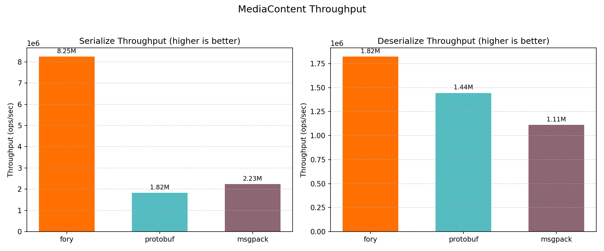
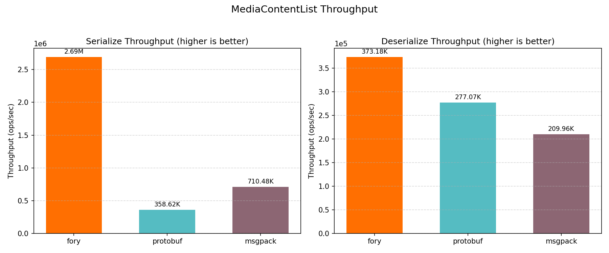
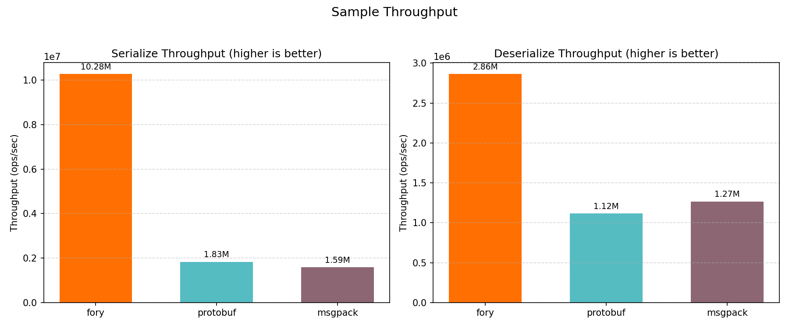
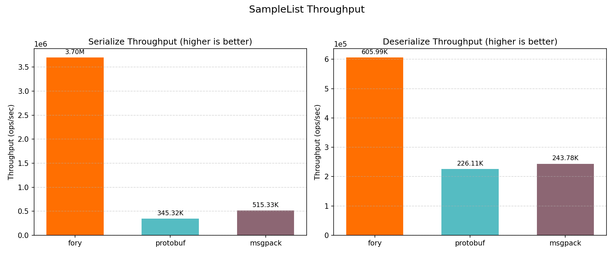
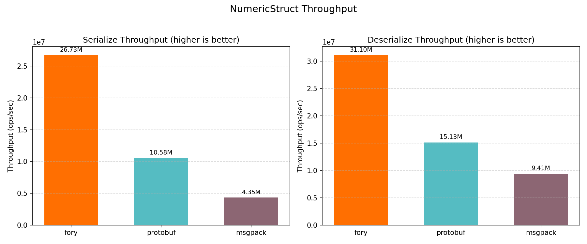
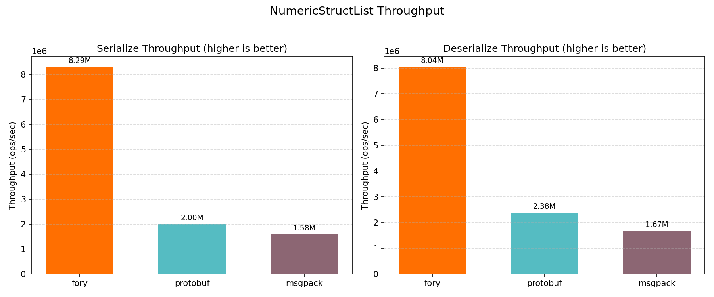

# Rust Benchmark Performance Report

_Generated on 2026-05-08 03:28:21_

## How to Generate This Report

```bash
cd benchmarks/rust
cargo bench --bench serialization_bench 2>&1 | tee results/cargo_bench.log
cargo run --release --bin fory_profiler -- --print-all-serialized-sizes | tee results/serialized_sizes.txt
python benchmark_report.py --log-file results/cargo_bench.log --size-file results/serialized_sizes.txt --output-dir results
```

## Hardware & OS Info

| Key                  | Value               |
| -------------------- | ------------------- |
| OS                   | Darwin 24.6.0       |
| Machine              | arm64               |
| Processor            | arm                 |
| CPU Cores (Physical) | 12                  |
| CPU Cores (Logical)  | 12                  |
| Total RAM (GB)       | 48.0                |
| Benchmark Date       | 2026-05-08T03:28:19 |

## Benchmark Plots

All class-level plots below show throughput (ops/sec).

### Throughput


### MediaContent



### MediaContentList



### Sample



### SampleList



### NumericStruct



### NumericStructList



## Benchmark Results

### Timing Results (nanoseconds)

| Datatype          | Operation   | fory (ns) | protobuf (ns) | msgpack (ns) | Fastest |
| ----------------- | ----------- | --------- | ------------- | ------------ | ------- |
| NumericStruct     | Serialize   | 37.4      | 94.5          | 230.1        | fory    |
| NumericStruct     | Deserialize | 32.2      | 66.1          | 106.3        | fory    |
| Sample            | Serialize   | 97.3      | 545.7         | 629.1        | fory    |
| Sample            | Deserialize | 349.1     | 894.3         | 789.1        | fory    |
| MediaContent      | Serialize   | 121.2     | 548.3         | 447.5        | fory    |
| MediaContent      | Deserialize | 548.6     | 692.2         | 899.3        | fory    |
| NumericStructList | Serialize   | 120.6     | 499.9         | 631.8        | fory    |
| NumericStructList | Deserialize | 124.4     | 419.7         | 598.6        | fory    |
| SampleList        | Serialize   | 270.3     | 2895.9        | 1940.5       | fory    |
| SampleList        | Deserialize | 1650.2    | 4422.7        | 4102.0       | fory    |
| MediaContentList  | Serialize   | 371.5     | 2788.5        | 1407.5       | fory    |
| MediaContentList  | Deserialize | 2679.7    | 3609.2        | 4762.7       | fory    |

### Throughput Results (ops/sec)

| Datatype          | Operation   | fory TPS   | protobuf TPS | msgpack TPS | Fastest |
| ----------------- | ----------- | ---------- | ------------ | ----------- | ------- |
| NumericStruct     | Serialize   | 26,727,248 | 10,577,086   | 4,346,503   | fory    |
| NumericStruct     | Deserialize | 31,097,428 | 15,129,280   | 9,410,879   | fory    |
| Sample            | Serialize   | 10,275,803 | 1,832,475    | 1,589,648   | fory    |
| Sample            | Deserialize | 2,864,919  | 1,118,243    | 1,267,315   | fory    |
| MediaContent      | Serialize   | 8,249,464  | 1,823,753    | 2,234,637   | fory    |
| MediaContent      | Deserialize | 1,822,722  | 1,444,627    | 1,112,013   | fory    |
| NumericStructList | Serialize   | 8,293,937  | 2,000,400    | 1,582,779   | fory    |
| NumericStructList | Deserialize | 8,038,585  | 2,382,768    | 1,670,425   | fory    |
| SampleList        | Serialize   | 3,700,004  | 345,316      | 515,331     | fory    |
| SampleList        | Deserialize | 605,987    | 226,106      | 243,784     | fory    |
| MediaContentList  | Serialize   | 2,691,573  | 358,616      | 710,480     | fory    |
| MediaContentList  | Deserialize | 373,176    | 277,070      | 209,965     | fory    |

### Serialized Data Sizes (bytes)

| Datatype          | fory | protobuf | msgpack |
| ----------------- | ---- | -------- | ------- |
| NumericStruct     | 78   | 93       | 87      |
| Sample            | 445  | 375      | 590     |
| MediaContent      | 362  | 301      | 500     |
| NumericStructList | 255  | 475      | 449     |
| SampleList        | 1978 | 1890     | 2964    |
| MediaContentList  | 1531 | 1520     | 2521    |
