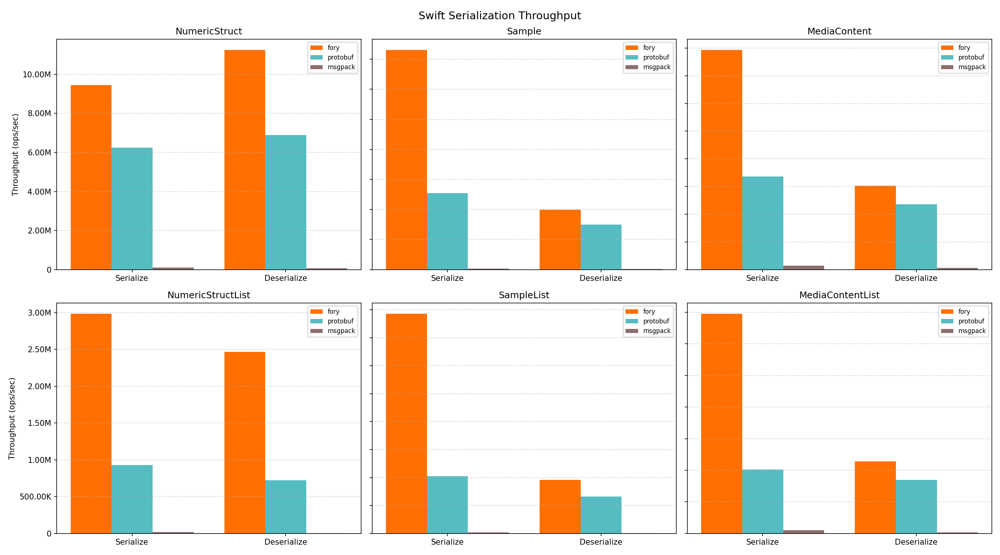

# Fory Swift Benchmark

This benchmark compares serialization and deserialization throughput for Apache Fory, Protocol Buffers, and MessagePack in Swift.

## Hardware and Runtime Info

| Key                   | Value                         |
| --------------------- | ----------------------------- |
| Timestamp             | 2026-05-07T19:46:19Z          |
| OS                    | Version 15.7.2 (Build 24G325) |
| Host                  | macbook-pro.local             |
| CPU Cores (Logical)   | 12                            |
| Memory (GB)           | 48.00                         |
| Duration per case (s) | 3                             |

## Throughput Results

| Datatype          | Operation   |   Fory TPS | Protobuf TPS | Msgpack TPS | Fastest      |
| ----------------- | ----------- | ---------: | -----------: | ----------: | ------------ |
| NumericStruct     | Serialize   |  9,456,190 |    6,237,003 |      99,134 | fory (1.52x) |
| NumericStruct     | Deserialize | 11,244,151 |    6,898,201 |      68,135 | fory (1.63x) |
| Sample            | Serialize   |  3,653,537 |    1,269,790 |      17,033 | fory (2.88x) |
| Sample            | Deserialize |    992,566 |      751,855 |      12,379 | fory (1.32x) |
| MediaContent      | Serialize   |  1,586,123 |      673,382 |      28,762 | fory (2.36x) |
| MediaContent      | Deserialize |    606,656 |      471,433 |      12,321 | fory (1.29x) |
| NumericStructList | Serialize   |  2,981,475 |      930,517 |      18,067 | fory (3.20x) |
| NumericStructList | Deserialize |  2,466,526 |      720,704 |       6,191 | fory (3.42x) |
| SampleList        | Serialize   |    784,804 |      205,426 |       3,356 | fory (3.82x) |
| SampleList        | Deserialize |    191,930 |      132,154 |       1,452 | fory (1.45x) |
| MediaContentList  | Serialize   |    347,354 |      100,939 |       5,460 | fory (3.44x) |
| MediaContentList  | Deserialize |    114,145 |       84,897 |       1,446 | fory (1.34x) |

## Serialized Size (bytes)

| Datatype          | Fory | Protobuf | Msgpack |
| ----------------- | ---: | -------: | ------: |
| NumericStruct     |   78 |       93 |     100 |
| Sample            |  445 |      375 |     737 |
| MediaContent      |  362 |      301 |     524 |
| NumericStructList |  255 |      475 |     513 |
| SampleList        | 1978 |     1890 |    3698 |
| MediaContentList  | 1531 |     1520 |    2639 |
